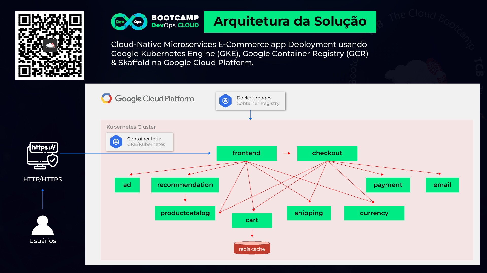

  <h1 align="center">Cloud-Native Microservices E-Commerce App Deployment Usando Google Kubernetes Engine (GKE), Google Container Registry (GCR) & Skaffold na Google Cloud Platform</h1>

## Descrição do projeto:
Neste projeto baseado em um cenário real, atuei como Engenheiro DevOps na migração de um aplicativo de comércio eletrônico de uma arquitetura monolítica para uma arquitetura de microsserviços nativa da nuvem.

Como a empresa utiliza uma Estratégia MultiCloud, o protótipo deveria ser criado em três diferentes provedores de cloud (AWS, Microsoft Azure e Google Cloud Plataform), para que os gestores pudessem avaliar qual seria o futuro serviço gerenciado de Kubernetes.

Além disso, foi solicitada a criação e hospedagem das imagens do Docker no provedor de cloud.

01 — Criar um Projeto na GCP ou usar um existente

# Configurar uma variável de ambiente: PROJECT_ID

PROJECT_ID=tcb-k8s
env | grep PROJECT_ID

# Garantir que as APIs estejam habilitadas ‘Google Kubernetes Engine’ e ‘Cloud Operations’:

gcloud services enable container.googleapis.com — project ${PROJECT_ID}

gcloud services enable monitoring.googleapis.com \
cloudtrace.googleapis.com \
clouddebugger.googleapis.com \
cloudprofiler.googleapis.com \
— project ${PROJECT_ID}

02 — Download dos arquivos fonte da aplicação:

wget https://tcb-bootcamps.s3.amazonaws.com/bootcamp-devops-cloud/pt/module4/tcb-bdc-module4-hop.zip
unzip tcb-bdc-module4-hop.zip

03 — Criar um cluster GKE (Standard Mode):

# Configurar variáveis de ambiente para “região” e “zona”:

REGION=us-central1
ZONE=us-central1-f

# Criação do Cluster ‘onlineboutique’:

gcloud container clusters create onlineboutique \
— project=${PROJECT_ID} — zone=${ZONE} \
— machine-type=e2-standard-2 — num-nodes=4

04 — Configurar permissões no cluster p/ kubectl:

gcloud container clusters get-credentials onlineboutique — zone us-central1-f

05 — Adicionar seu nome na linha 40 no arquivo footer.html (frontend microservice)

cd tcb-bdc-module4-hop/onlineboutique/
vi src/frontend/templates/footer.html

06 — Utilizar o Skaffold para fazer “build & push” das Imagens para o Google Container Registry (GCR) e fazer o ‘deploy’ dos microsserviços para o cluster do Kubernetes com apenas um comando:

skaffold
skaffold version

cd tcb-bdc-module4-hop/onlineboutique
skaffold run — default-repo gcr.io/${PROJECT_ID}

# 07 — Aguardar o provisionamento dos Pods

kubectl get pods

08 — Acessar o frontend usando EXTERNAL_IP

kubectl get service frontend-external | awk ‘{print $4}’

08 — Acessar o frontend usando EXTERNAL_IP

kubectl get service frontend-external | awk ‘{print $4}’

Site Rodando:

